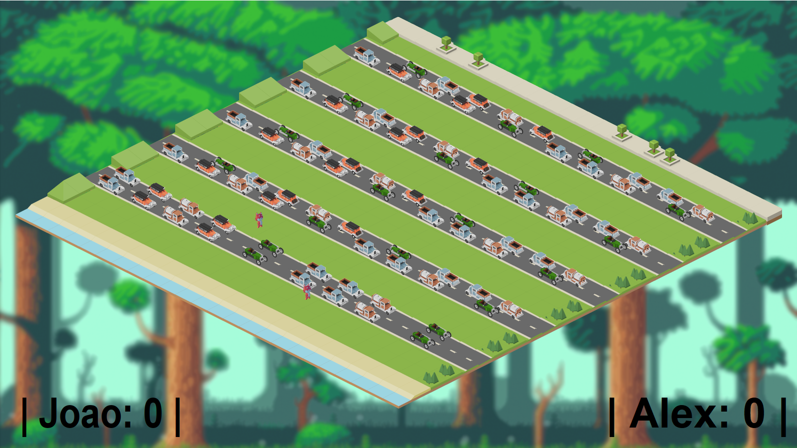

# crosstheroad
Multiplayer game proof of concept (PoC) where a fox tries to cross a road. Heavily inspired by crossy road. Up to two players online.

Game is the game client. The client is not designed to work offline, as such you always require to connect to a game server and wait for a player for the game to start. 
The client uses a graphics library called Simple Graphics.

To start the client you should use: java -jar Game.jar <username> <server-address> <serverport>

GameServer only contains the Game logic. The communication is made by User Datagram Protocol (UDP) using Java DatagramSocket, the data uses a very simple serialization method to be transfered arround using only commas and semicolons. The game server will wait until 2 players join to start running the game logic.
The cars positions and the opponent position is streamed to the clients.

To start the server: java -jar GameServer.jar <serverPort>

Dependencies:
Simple Graphics Library: https://github.com/academia-de-codigo/simple-graphics

</img>
